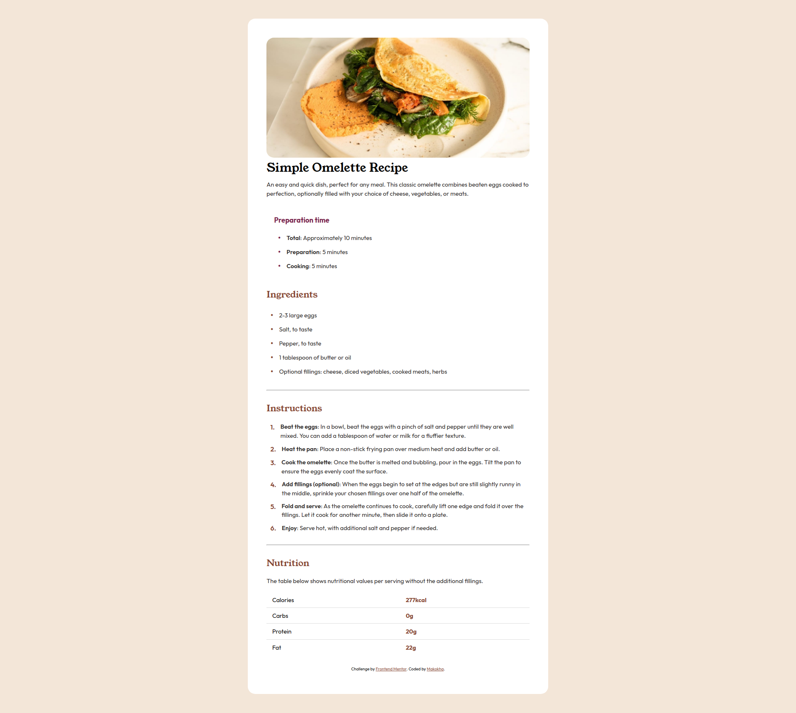
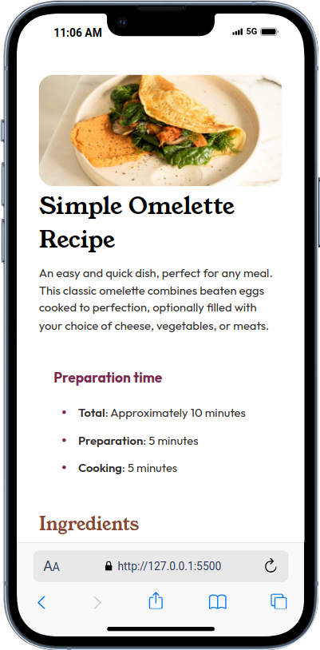

# Frontend Mentor - Recipe page solution

This is a solution to the [Recipe page challenge on Frontend Mentor](https://www.frontendmentor.io/challenges/recipe-page-KiTsR8QQKm).

## Table of contents

- [Overview](#overview)
  - [The challenge](#the-challenge)
  - [Screenshot](#screenshot)
  - [Links](#links)
- [My process](#my-process)
  - [Built with](#built-with)
  - [What I learned](#what-i-learned)
  - [Useful resources](#useful-resources)
- [Author](#author)


## Overview
This is a recipe page that can be used as a template for many other Food recipes.

### Screenshots



### Links

- Solution URL: [Solution URL](https://github.com/DonFranklie/recipe-page-main)
- Live Site URL: [Live site URL](https://donfranklie.github.io/recipe-page-main/)

## My process

### Built with

- Semantic HTML5 markup
- CSS custom properties
- Flexbox
- Mobile-first workflow

### What I learned
1. The use of max width and min width
2. Use of Mibile first approach
```css
.recipe {
  max-width: 800px;
}
```

### Continued development

Using the Mobile first workflow.

### Useful resources
- ChatGPT 4o

## Author
SWE Franklin Makokha